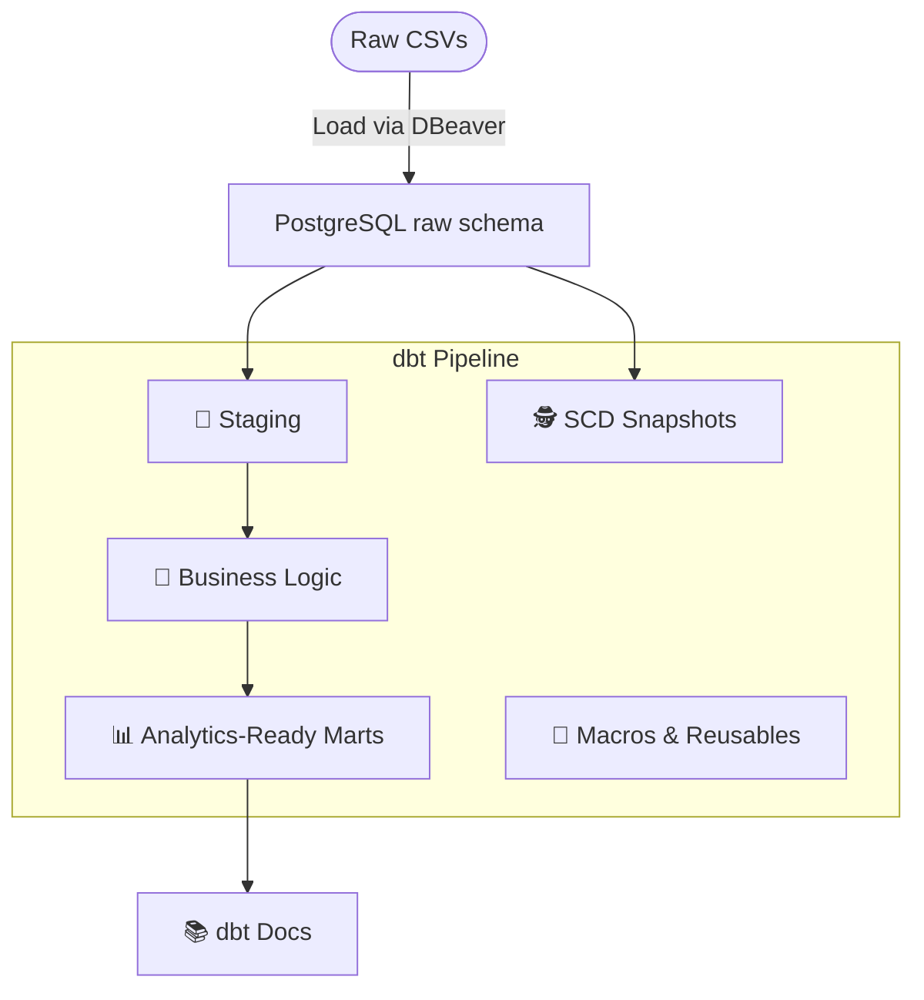

# 🧠 Modern dbt Data Warehouse

[](https://www.getdbt.com/)
[](https://www.postgresql.org/)
[](https://www.docker.com/)
[](LICENSE)

---

## 📌 Overview

This project implements a **modular, production-ready dbt data warehouse** for an e-commerce analytics domain using PostgreSQL and Docker. It showcases best practices in **data modeling, testing, documentation, macros**, and **snapshots**.

You’ll find a complete architecture designed to reflect modern analytics workflows, ideal for portfolio presentation or real-world deployment.

---

## 🧱 Architecture



---

## ✨ Key Features
* Source Configuration for raw Postgres tables

* Staging Models for cleaned, typed, and normalized data

* Intermediate Models for reusable business logic

* Marts for customer LTV and sales KPIs

* Data Quality Tests with unique, not_null, and assertions

* Snapshots using dbt’s SCD Type 2 tracking

* Macros for reusable logic: currency conversion, safe division, formatting

* Auto-generated dbt Docs and model DAG

* PostgreSQL + Docker setup

---

## 📁 Project Structure

```bash
analytics_warehouse/
├── models/
│   ├── src/                # dbt sources
│   ├── staging/            # cleaned staging layer
│   ├── intermediate/       # joins and business rules
│   └── marts/              # final analytics tables
├── snapshots/              # historical tracking
├── macros/                 # reusable Jinja macros
├── seeds/                  # static reference data (if used)
├── dbt_project.yml         # dbt config
├── profiles.yml            # dbt connection (outside repo)
```

---

## 🚀 How to Run Locally
Requires: Docker, dbt-core (pip install dbt-postgres)
1. Spin up PostgreSQL
```bash
docker run --name modern_pg -e POSTGRES_USER=modern_dbt -e POSTGRES_PASSWORD=modern -e POSTGRES_DB=analytics -p 5432:5432 -d postgres
```
2. Load Raw CSVs into schema raw using DBeaver
3. Run dbt models
```bash
dbt run
dbt test
```
4. Generate & serve docs
```bash
dbt docs generate
dbt docs serve
```

---

## 🧪 Data Quality & Snapshots
* Snapshots: snapshots/customers_snapshot.sql tracks email history

* Tests: Defined in schema.yml for each model

* Macros:

  * convert_usd()

  * safe_divide()

  * format_currency()

  * is_high_value_order()

---

## 🔮 Future Enhancements

This project is built to scale and evolve. Planned or ideal future improvements include:

- **📦 Modular dbt Packages**
  - Integrate with `dbt-utils`, `dbt-expectations`, and build custom reusable packages

- **🧪 Advanced Data Validation**
  - Implement row-level assertions, custom constraints, and null-check coverage using `dbt-expectations`

- **🕵️ Data Freshness Monitoring**
  - Add `dbt source freshness` and automate alerting for stale data

- **🌐 Hosted Documentation**
  - Deploy dbt docs via GitHub Pages or Netlify for live online access

- **⚙️ CI/CD Automation**
  - Use GitHub Actions to automate `dbt run`, `test`, and docs generation on pull requests

- **📊 BI Tool Integration**
  - Connect final marts to Power BI, Metabase, or Superset for dashboards

- **🧠 Semantic Layer & Metrics**
  - Define reusable business metrics using the dbt `metrics:` feature (dbt ≥ 1.5)

- **💾 Incremental Materialization**
  - Convert large fact tables to `incremental` mode for optimized rebuilds

- **📈 Performance Optimization**
  - Benchmark model runtime and add indexes or materialized views where necessary

---

## 🧑‍💻 Author
**Derek Acevedo**
Data Engineer | SQL & dbt Enthusiast

🔗 [LinkedIn](https://www.linkedin.com/in/derekacevedo86)
🔗 [GitHub](https://www.github.com/poloman2308)

